<div align="center">


<br/>

[](https://linkedin.com/in/mohamedhamed77)
[](mailto:mohamedhamed.business1@gmail.com)
[](https://github.com/MohamedHamed-bot)
[](https://www.kaggle.com/)

<br/>


</div>

---

## 👨‍💻 About Me

```python
analyst = {
    "name"        : "Mohamed Hamed",
    "role"        : "Data Analyst | BI Developer",
    "location"    : "Egypt 🇪🇬  —  Open to Remote & Freelance",
    "education"   : "B.Sc. Business Administration — Kafr El-Sheikh University (2024)",
    "experience"  : ["B2B Sales & PR (Remote, Saudi Co.)", "MeriSKILL Internship — Data Analyst"],
    "focus"       : ["EDA & Statistical Analysis", "Dashboard Design", "Predictive Modeling"],
    "projects"      : "20+ across Power BI, Python & SQL",
    "certifications": ["Google Data Analytics", "IBM Data Analyst", "DataCamp Associate DA"],
    "tools"       : ["Power BI", "Python", "SQL", "Excel", "Jupyter"],
    "philosophy"  : "Without data, you're just another person with an opinion. — W. Edwards Deming"
}
```

---

## 🛠️ Technical Skills

### BI & Visualization


### Python Ecosystem


### Databases & Query Languages


### Dev & Collaboration


---

## 🏅 Certifications

| Certification | Issuer | Year |
|---|---|---|
| 📊 Google Data Analytics Professional Certificate | Google | 2023 |
| 🔬 IBM Data Analyst Professional Certificate | IBM | 2023 |
| 🏕️ DataCamp Associate Data Analyst | DataCamp | 2023 |

---

## 📂 Featured Projects

### 📊 Business Intelligence & Dashboards

| Project | Tools | Highlights |
|---|---|---|
| [🏢 Revenue Growth Analysis — Geidea](https://github.com/MohamedHamed-bot) | Power BI · DAX | Top-5 reps tracking, regional revenue by Alex/Cairo/Giza, category breakdown; 112% achievement rate |
| [👥 HR Employees Attrition Dashboard](https://github.com/MohamedHamed-bot) | Power BI · Excel | Analyzed 1,470 employees; 16% attrition rate identified across job roles, education, gender & travel |
| [💰 Personal Finance Tracker](https://github.com/MohamedHamed-bot) | Power BI · Excel | Live balance tracker with income goal progress, spending breakdown & net worth visualization |

### 🐍 Python Analytics

| Project | Tools | Highlights |
|---|---|---|
| [🛒 Market Basket Analysis](https://github.com/MohamedHamed-bot) | Python · Mlxtend · Seaborn | Association rules mining using Apriori algorithm; actionable product bundling recommendations |
| [🩺 Diabetes Prediction — EDA & Clustering](https://github.com/MohamedHamed-bot) | Python · Pandas · Scikit-learn | Full EDA pipeline: univariate → bivariate → multivariate analysis + K-Means clustering with Elbow Method on 768 patients |
| [☕ Coffee & Code Developer Survey](https://github.com/MohamedHamed-bot) | Python · Seaborn | Survey analysis of 100+ developers — coding habits, coffee preferences & productivity correlations |

---

## 💡 What I Bring to the Table

<table>
  <tr>
    <td align="center" width="25%"><b>📊 Dashboard Design</b><br/><sub>Interactive Power BI reports that guide real decisions, not just display numbers</sub></td>
    <td align="center" width="25%"><b>🧹 Data Cleaning</b><br/><sub>Transforming messy raw data into reliable, analysis-ready datasets using Python & Excel</sub></td>
    <td align="center" width="25%"><b>🔍 EDA & Insights</b><br/><sub>Uncovering the "why" behind every pattern — from correlation matrices to K-Means clustering</sub></td>
    <td align="center" width="25%"><b>📈 Statistical Analysis</b><br/><sub>Applying the right methods to validate findings, test hypotheses & surface KPIs that matter</sub></td>
  </tr>
</table>

---

## 📊 GitHub Stats

<div align="center">


&nbsp;&nbsp;


<br/>


</div>

---

## 🏆 GitHub Trophies

<div align="center">
  
</div>

---

## 🐍 Contribution Graph

<div align="center">
  <picture>
    <source media="(prefers-color-scheme: dark)" srcset="https://raw.githubusercontent.com/MohamedHamed-bot/MohamedHamed-bot/output/pacman-contribution-graph-dark.svg">
    <source media="(prefers-color-scheme: light)" srcset="https://raw.githubusercontent.com/MohamedHamed-bot/MohamedHamed-bot/output/pacman-contribution-graph.svg">
    
  </picture>
</div>

---

## 🤝 Let's Connect

<div align="center">

I'm actively seeking **Data Analyst** opportunities — remote, hybrid, or on-site in Egypt & Gulf.

If you have a dataset that needs a story, let's talk.

[](https://linkedin.com/in/mohamedhamed77)
&nbsp;
[](mailto:mohamedhamed.business1@gmail.com)

<br/>

> *"Without data, you're just another person with an opinion."*
> — W. Edwards Deming

<br/>

⭐ If you find my work useful, a star on a repo means a lot — thank you!

</div>
